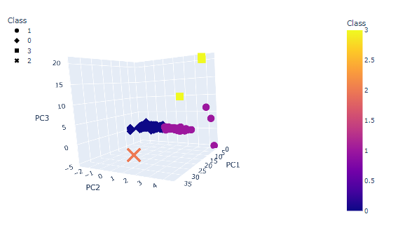
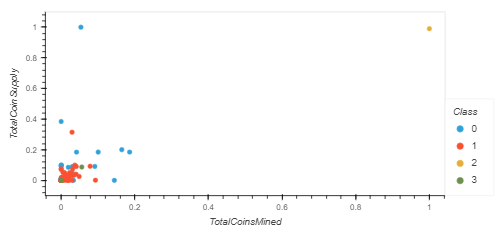

# **Cryptocurrencies**

## **Objective**
The purpose of the anlaysis was to highlight unsupervised learning methods to classify exististing cryptocurrencies for a potential new investment vehicle.
## **Results**

### **3D Clusters Results**

### **Scatterplot Results**
